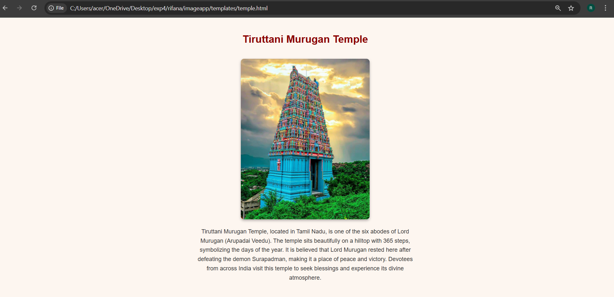

# Ex04 Places Around Me
# Date: 04/10/2025
# AIM
To develop a website to display details about the places around my house.

# DESIGN STEPS
## STEP 1
Create a Django admin interface.

## STEP 2
Download your city map from Google.

## STEP 3
Using <map> tag name the map.

## STEP 4
Create clickable regions in the image using <area> tag.

## STEP 5
Write HTML programs for all the regions identified.

## STEP 6
Execute the programs and publish them.

# CODE
```
map.html

<html>
    <head >
        <title>
            Image Map
        </title>
    </head>
    <style>
          h1{ text-align: center};
          h2{text-align: center; -webkit-text-fill-color: aqua;}
          img{border:2px }
    </style>
    <body>
        <h1>TIRUTTANI</h1>
        <h2 text align="center">Rifana Barveen M (25009917)</h2>
        
        <map name="#map">
        <area shape="rect" coords="1577,85,1574,17" alt="Ractangle" href="temple.html">
        <area shape="rect" coords="707,259,704,181" alt="Ractangle" href="school.html">
         <area shape="rect" coords="1061,107,1064,25" alt="Ractangle" href="cinema.html">
          <area shape="rect" coords="668,71,670,3" alt="Ractangle" href="train.html">
           <area shape="rect" coords="707,259,704,181" alt="Ractangle" href="home.html">

        
        </map>

    </body>
</html>

home.html

<!DOCTYPE html>
<html lang="en">
<head>
  <meta charset="UTF-8">
  <title>MY HOME</title>
  <style>
    body {
      font-family: Arial, sans-serif;
      background-color: #fdf6f0;
      text-align: center;
      padding: 20px;
    }
    h1 {
      color: darkred;
    }
    img {
      width: 400px;
      border-radius: 10px;
      margin: 20px 0;
      box-shadow: 0 4px 8px rgba(0,0,0,0.3);
    }
    p {
      font-size: 18px;
      color: #333;
      max-width: 700px;
      margin: auto;
      line-height: 1.6;
    }
  </style>
</head>
<body>
  <h1>MY HOME</h1>
  
  <p>
    A home is a place to feel safe, loved, cozy, and so much more! No one could change my mind about what a home is, 
    because a home is where you learn from your mistakes, be yourself, and feel like you belong. When I am at home, 
    I feel like I am a powerful, amazing, beautiful person.
    My house is a place filled with warmth, safety, and the memories of a loving family."
    This sentence establishes the key emotional aspects of a home and sets the tone for the subsequent details you will provide.
  </p>
</body>
</html>

cinema.html

<!DOCTYPE html>
<html lang="en">
<head>
  <meta charset="UTF-8">
  <title>GOLDEN CINEMAS </title>
  <style>
    body {
      font-family: Arial, sans-serif;
      background-color: #fdf6f0;
      text-align: center;
      padding: 20px;
    }
    h1 {
      color: darkred;
    }
    img {
      width: 400px;
      border-radius: 10px;
      margin: 20px 0;
      box-shadow: 0 4px 8px rgba(0,0,0,0.3);
    }
    p {
      font-size: 18px;
      color: #333;
      max-width: 700px;
      margin: auto;
      line-height: 1.6;
    }
  </style>
</head>
<body>
  <h1>GOLDEN CINEMAS</h1>
  
  <p>
    Golden Cinemas in Tiruttani is a popular cinema hall located in the Kannikapuram and Gandhi Road,
    Kalaignar Nagar areas, offering a modern viewing experience with features like RGB Laser projection, 
    Dolby 7.1 sound, 3D capabilities, and air conditioning. Patrons can enjoy a variety of movies,
    including recent releases, with multiple showtimes throughout the day, and the cinema serves as a central hub for entertainment in Tiruttani.
    While the establishment prides itself on customer satisfaction and aims for future expansion, it's noted that ticket cancellations are not permitted.
  </p>
</body>
</html>

school.html

<!DOCTYPE html>
<html lang="en">
<head>
  <meta charset="UTF-8">
  <title>MY SCHOOL </title>
  <style>
    body {
      font-family: Arial, sans-serif;
      background-color: #fdf6f0;
      text-align: center;
      padding: 20px;
    }
    h1 {
      color: darkred;
    }
    img {
      width: 400px;
      border-radius: 10px;
      margin: 20px 0;
      box-shadow: 0 4px 8px rgba(0,0,0,0.3);
    }
    p {
      font-size: 18px;
      color: #333;
      max-width: 700px;
      margin: auto;
      line-height: 1.6;
    }
  </style>
</head>
<body>
  <h1>MY SCHOOL TKV</h1>
  
  <p>
    Thalapathy K. Vinayakam school (TKVSchools) is a prominent educational institution in Tiruttani,
    founded in 1995 by the Thalapathy K. Vinayakam Educational Trust to serve the rural population.
    Named after the social reformer "Thanigai Meeta Thalapathy" K. Vinayakam, 
    who fought for Tiruttani's integration into Tamil Nadu, the school offers a comprehensive Matriculation Syllabus for students 
    from Pre-KG to Class 12. Managed by an experienced staff, the school emphasizes academic excellence, communication skills, 
    and personality development within a secure and child-friendly environment, also providing higher education through the affiliated 
    Thalapathy K. Vinayakam Women's Arts and Science College
  </p>
</body>
</html>

temple.html

<!DOCTYPE html>
<html lang="en">
<head>
  <meta charset="UTF-8">
  <title>Tiruttani Murugan Temple</title>
  <style>
    body {
      font-family: Arial, sans-serif;
      background-color: #fdf6f0;
      text-align: center;
      padding: 20px;
    }
    h1 {
      color: darkred;
    }
    img {
      width: 400px;
      border-radius: 10px;
      margin: 20px 0;
      box-shadow: 0 4px 8px rgba(0,0,0,0.3);
    }
    p {
      font-size: 18px;
      color: #333;
      max-width: 700px;
      margin: auto;
      line-height: 1.6;
    }
  </style>
</head>
<body>
  <h1>Tiruttani Murugan Temple</h1>
  
  <p>
    Tiruttani Murugan Temple, located in Tamil Nadu, is one of the six abodes of Lord Murugan (Arupadai Veedu).
    The temple sits beautifully on a hilltop with 365 steps, symbolizing the days of the year. 
    It is believed that Lord Murugan rested here after defeating the demon Surapadman, making it a place of peace and victory.
    Devotees from across India visit this temple to seek blessings and experience its divine atmosphere.
  </p>
</body>
</html>

train.html

<!DOCTYPE html>
<html lang="en">
<head>
  <meta charset="UTF-8">
  <title>TIRUTTANI RAILWAY STATION </title>
  <style>
    body {
      font-family: Arial, sans-serif;
      background-color: #fdf6f0;
      text-align: center;
      padding: 20px;
    }
    h1 {
      color: darkred;
    }
    img {
      width: 400px;
      border-radius: 10px;
      margin: 20px 0;
      box-shadow: 0 4px 8px rgba(0,0,0,0.3);
    }
    p {
      font-size: 18px;
      color: #333;
      max-width: 700px;
      margin: auto;
      line-height: 1.6;
    }
  </style>
</head>
<body>
  <h1>TIRUTTANI RAILWAY STATION</h1>
  
  <p>
    construction date of the Tiruttani railway station isn't specified in the provided information,
    it is known to be a functional railway station on the Chennai-Gudur line, serving the Howrah-Chennai main line
    and the West North Line of the Chennai Suburban Railway. The station, with code TRT, is located in Tiruttani,
    Tamil Nadu, operated by Southern Railway, and was built to facilitate access to the significant pilgrimage sites in the area, 
    such as the Arulmigu Subramaniaswamy Temple. As part of the Madras (now Tamil Nadu) state following a boundary change, 
    Tiruttani's railway connection has a long history, but specific details about the station's initial construction and history are not available.
  </p>
</body>
</html>
```
# OUTPUT
.png>)





# RESULT
The program for implementing image maps using HTML is executed successfully.
